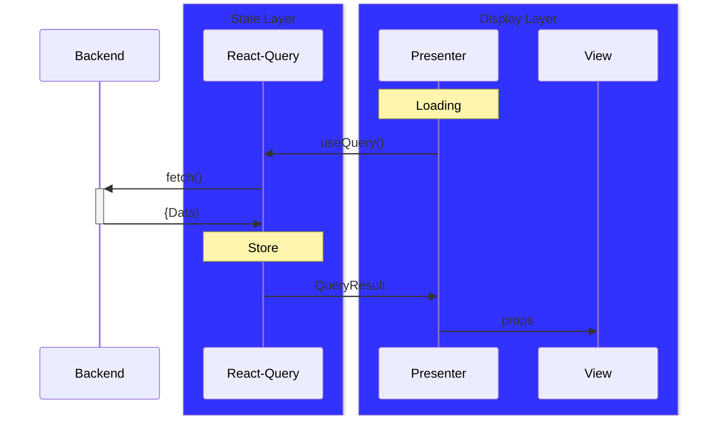

# Data-Fetching Flow

- `State Layer` **stores & manages** data
- `Event Layer` **writes** data
- `Display Layer` **reads** data

> `Interactor` manages events
>
> `React-Query` manages Network-states
>
> `States` manages UI-states
