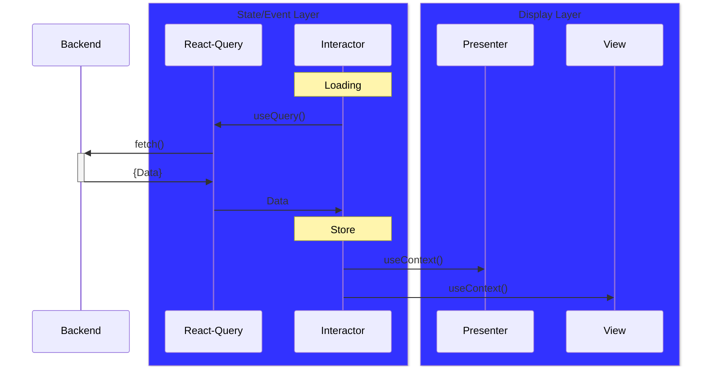

# Fetching Dataflow

- `State Layer` **stores & manages** data
- `Event Layer` **writes** data
- `Display Layer` **reads** data

> In this diagram, state layer and event layer are combined
>
> `Interactor` manages both UI-states and events
>
> `React-Query` manages Network-states
